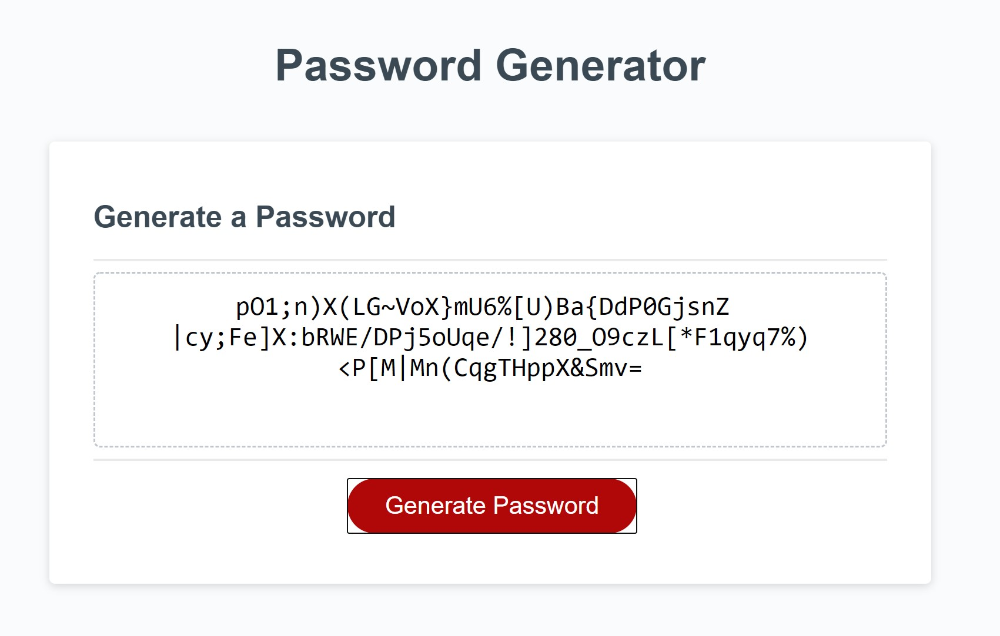

IT'S ALL ABOUT ME - my first personal website

Requirements: A website that has the following functional elements: A navbar, A reponsive layout, and Responsive images.

I've had alot of growth working on this project, and really feel like this has helped my CSS and HTML come on in force. Additionally bootstrap has been mindblowing, and the different elements and styles and how they can be incorporated makes it one of those tools you'll use for life.

As a side note, this is my first website that is completely of it's own code and design, and is not perfect, but represents the best I could do without needing outside help. 

I've included images of the site and it's 3 pages and what the look like on large format screens.

A link to the site can be found here: https://eellis4500.github.io/

